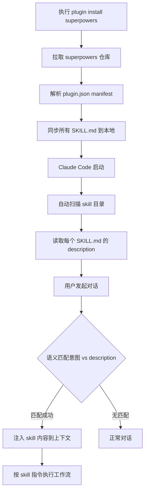

# Superpowers — 概述与安装

> 项目地址：https://github.com/obra/superpowers

---

## 什么是 Superpowers？

Superpowers 是一个面向 AI 编码助手的**开发工作流框架**。它通过一套可组合的「技能」（Skills），让 AI Agent 在编写代码之前，先走结构化的软件工程流程——需求澄清 → 工作区隔离 → 任务规划 → TDD 实现 → 代码评审 → 分支收尾。

**核心价值：** 让 AI Agent 更可靠地执行长周期开发任务，引入工程纪律，而不是直接跳进写代码。

---

## 安装方式

| 平台 | 安装命令 |
|------|----------|
| **Claude Code** | `/plugin install superpowers@claude-plugins-official` |
| **Cursor** | Agent 对话中输入 `/add-plugin superpowers` |
| **Gemini CLI** | `gemini extensions install https://github.com/obra/superpowers` |

安装后技能**自动触发**，无需额外配置。

**更新：** `/plugin update superpowers`

**验证是否生效：** 对 Agent 说「帮我规划这个功能」，观察是否走需求澄清流程。

### 安装作用域说明

执行安装命令后，Claude Code 会提示选择安装范围：

| 选项 | 作用域 | 存储位置 | 适用场景 |
|------|--------|----------|---------- |
| Install for you (user scope) | 当前用户全局生效 | `~/.claude/plugins/` | 个人开发者，希望在所有项目中都能使用 |
| Install for all collaborators (project scope) | 提交到仓库，团队共享 | `.claude/plugins/`（纳入 git） | 团队项目，希望所有成员统一使用相同工作流 |
| Install for you, in this repo only (local scope) | 仅当前仓库、仅自己 | `.claude/plugins.local/`（不纳入 git） | 个人在特定项目中试用，不影响他人 |

**各选项优缺点：**

#### user scope（推荐个人使用）

- 优点：一次安装，所有项目生效，无需重复操作
- 优点：重启电脑、切换项目目录后仍然生效（配置写入 `~/.claude/`，与项目无关）
- 缺点：与项目无关，团队成员不会自动获得

#### project scope（推荐团队使用）

- 优点：随仓库分发，团队成员 clone 后自动获得，工作流统一
- 优点：配置写入项目根目录 `.claude/plugins/`，纳入 git 版本控制
- 缺点：需要团队成员都认可引入该插件；插件配置暴露在仓库中

#### local scope（推荐试用）

- 优点：完全隔离，不影响他人，不污染仓库
- 优点：配置写入项目根目录 `.claude/plugins.local/`，被 `.gitignore` 排除，不提交到仓库
- 缺点：仅自己可用，换机器后需重新安装

**建议：** 个人学习用 `user scope`；团队项目统一工作流用 `project scope`；不确定是否长期使用时先选 `local scope` 试用。

---

## 安装后的生效机制

### 第一阶段：安装

命令执行后，Claude Code：

1. 从插件源拉取 superpowers 仓库内容
2. 解析插件 manifest（`plugin.json`）
3. 将所有 `SKILL.md` 同步到本地 `.claude/skills/` 目录

### 第二阶段：加载（每次启动时）

Claude Code 启动时自动扫描 skill 目录，读取每个 `SKILL.md` 的 frontmatter：

```yaml
---
name: brainstorming
description: Use when designing new features. Refines ideas through questions...
---
```

`description` 字段是触发的关键——它描述这个 skill 的适用场景。

### 第三阶段：触发（每次对话时）

- **自动触发**：Agent 将用户意图与所有 skill 的 `description` 做语义匹配，自动注入匹配的 skill 内容到上下文
- **手动触发**：直接输入 `/brainstorming` 等命令

### 完整链路



> **渐进式加载**：`references/` 和 `scripts/` 只在 skill 被激活时才读入，不会一次性撑满上下文。

---

## 设计哲学

- **测试先行（TDD always）**：禁止在没有失败测试的情况下写实现代码
- **系统化流程优于随机猜测**：每个调试步骤都要有假设和验证
- **简洁为首要目标**：遵循 YAGNI（你不会需要它）和 DRY（不重复自己）
- **用证据验证**：不接受「应该好了」，必须有测试通过证明

---

## 与其他概念的关系

| 概念 | 关系 |
|------|------|
| MCP（Model Context Protocol） | 不同层次：MCP 解决 AI 与外部系统的数据连接；Superpowers 解决 AI 的开发工作流纪律 |
| Spring AI `@Tool` | 不同层次：`@Tool` 是 Java 代码层的工具调用；Superpowers 是 Agent 行为层的流程约束 |
| Claude Code Skill | 实现机制相似：Superpowers 的 Skill 与 Claude Code 的 `/skill` 概念一脉相承 |
